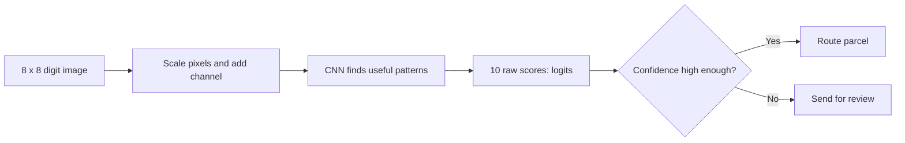
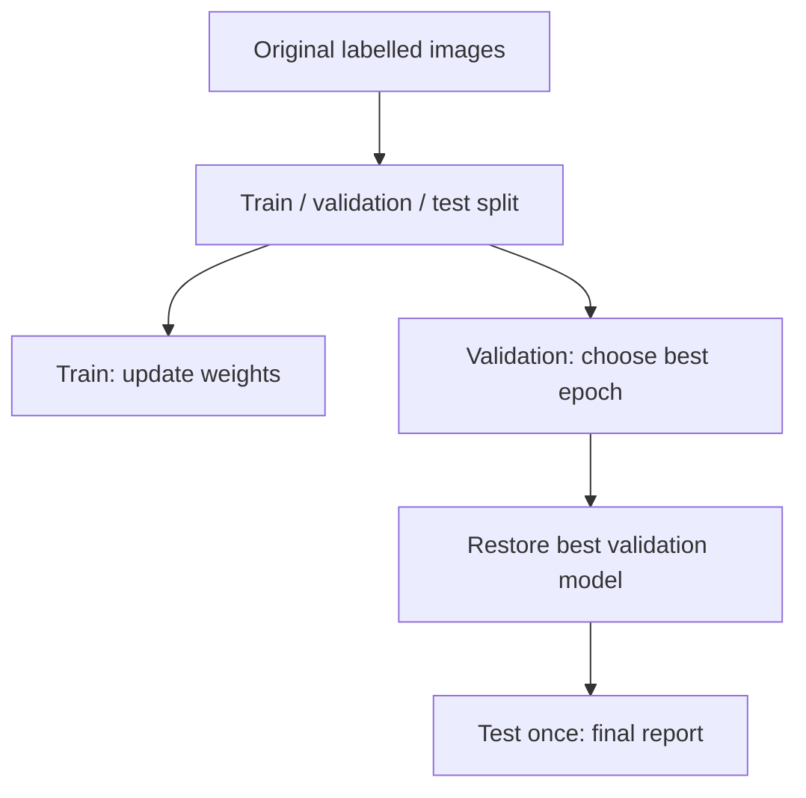

# Applied CNNs: Reading Parcel-Label Digits


**Problem:** A warehouse camera reads one handwritten digit from a parcel label. The system predicts the digit and routes the parcel to the matching lane.




## 1. Why use a CNN for images?

An image is not just a long list of numbers. Nearby pixels usually belong to the same small visual pattern: an edge, a curve, a corner, or part of a digit.

A fully connected neural network can classify images after flattening them. However, it must learn separately that a pattern at the top-left and the same pattern at the bottom-right are related. A CNN makes two useful assumptions:

- **Local connectivity:** a small filter looks at nearby pixels together.
- **Weight sharing:** the same filter looks for the same pattern everywhere in the image.

```text
Pixels → edges and curves → digit strokes and loops → digit class
```

This means a CNN usually needs fewer parameters than a large dense layer for image tasks.

> A CNN does not automatically understand every possible shift or rotation. It becomes more tolerant to realistic changes through its design, training data, and augmentation.

---

## 2. The image tensor contract

PyTorch `Conv2d` expects image batches in **NCHW** order:

```text
N = number of images in the batch
C = number of channels
H = image height
W = image width

shape = [N, C, H, W]
```

Examples:

| Image type | One image | Batch of 32 images |
|---|---|---|
| Grayscale digit | `[1, 8, 8]` | `[32, 1, 8, 8]` |
| RGB photo | `[3, 224, 224]` | `[32, 3, 224, 224]` |

The Digits dataset stores pixel values from `0` to `16`. In the lab, we divide by `16` so the model receives values from `0` to `1`, then add the one grayscale channel.

```python
scaled = image / 16.0
cnn_input = scaled.unsqueeze(0)  # [1, 8, 8] for one grayscale image
```

---

## 3. Convolution in one idea

A convolutional filter is a small grid of trainable numbers. It slides across the image. At each position, it multiplies the filter values with the nearby pixels and adds the results.

```text
Input patch             Vertical-edge filter
1  2  3                 -1  0  1
4  5  6                 -1  0  1
7  8  9                 -1  0  1
```

The result is one value in a **feature map**. A real CNN learns many filters. Some may respond to edges, curves, or other useful digit patterns.

### Output-size rule

For one height or width dimension:

```text
output = floor((input + 2 × padding - dilation × (kernel - 1) - 1) / stride) + 1
```

For the common case `input=8`, `kernel=3`, `padding=1`, `stride=1`, the output stays `8`. The lab calculates this and checks it with code.

---

## 4. Our small CNN

```text
Input                 [N,  1, 8, 8]
Conv + ReLU           [N, 16, 8, 8]
MaxPool               [N, 16, 4, 4]
Conv + ReLU           [N, 32, 4, 4]
MaxPool               [N, 32, 2, 2]
Flatten               [N, 128]
Dense layers          [N, 10]
```

The final ten values are **logits**: unrestricted scores, one per digit. They are not probabilities yet.

```python
loss_function = nn.CrossEntropyLoss()
loss = loss_function(logits, labels)
```

Use raw logits with `CrossEntropyLoss`. Do not add `softmax` before this loss function.

---

## 5. A safe training workflow



- **Training data** updates the model weights.
- **Validation data** helps select the epoch and settings.
- **Test data** is kept aside until the final evaluation.

This separation prevents us from accidentally choosing a model because it happened to perform well on the final test examples.

One training batch follows this order:

```text
model.train()
clear old gradients
forward pass
CrossEntropyLoss
backward pass
optimizer step
```

During validation or prediction, use `model.eval()` and disable gradients with `torch.inference_mode()`.

---

## 6. Evaluate like an engineer

Accuracy answers: “How often was the prediction correct?” It is useful, but incomplete.

Also inspect:

- a **confusion matrix** to see which digits are mixed up;
- **precision and recall** for each digit;
- misclassified images to understand actual failures;
- confidence, because a low-confidence case can be sent for human review.

```text
High confidence → automatic route
Low confidence  → manual review
```

Softmax confidence is helpful but not a guarantee that a prediction is correct. Pick any review threshold based on the cost of wrong routing and the available review capacity.

---

## 7. Save the complete inference contract

Model weights alone are not enough. Save the information that another program needs to prepare an image exactly as the model expects:

- architecture settings and model weights;
- class names (`0` to `9`);
- input shape and channel order;
- pixel scaling rule;
- selected validation epoch and experiment details.

After saving, reload into a fresh model and compare logits. Matching outputs is stronger evidence than a successful `torch.save()` call.

---
