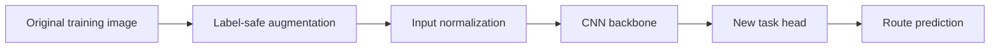

# Data Augmentation, Normalization, and Transfer Learning


> **Project example:** A warehouse camera reads a handwritten digit on a parcel. We have many labeled digit images, but only a small number are labeled for the final routing task.

We will learn three ideas:

```text
Data augmentation → show useful variations of training images
Normalization     → keep values on a useful and consistent scale
Transfer learning → reuse features learned by another model
```



---

# 1. Data augmentation

## 1.1 What is data augmentation?

Data augmentation creates a slightly changed view of a training image.

Example:

```text
Original parcel digit 7
    ├── move slightly left
    ├── rotate by 5 degrees
    ├── make slightly darker
    └── add a little camera noise

The label is still 7.
```

The image changes, but the correct label should remain the same.

## 1.2 Why do we use it?

Suppose every `7` in the training data is perfectly centered. The model may learn:

```text
7 means a centered shape
```

But a real camera may capture the digit slightly to the left. Augmentation teaches:

```text
7 is still 7 even when position, lighting, or focus changes slightly
```

Main benefits:

- reduces memorization;
- improves generalization;
- makes the model more robust to expected image changes;
- is useful when labeled data is limited.

Augmentation does not replace collecting real data. It only creates more views of data we already have.

## 1.3 Most commonly used image augmentations

| Augmentation | What it does | Common use | Avoid when |
|---|---|---|---|
| `RandomHorizontalFlip` | flips left and right | animals, objects, natural photos | text, digits, left/right medical meaning |
| `RandomVerticalFlip` | turns image upside down | satellite and microscopy images | normal photos and text |
| `RandomRotation` | rotates by a small angle | camera tilt, scanned pages | direction itself defines the label |
| `RandomResizedCrop` | randomly crops and resizes | object classification | important object may be removed |
| `ColorJitter` | changes brightness, contrast, color | different lighting conditions | color is medically or scientifically important |
| `GaussianBlur` | adds mild blur | focus or motion variation | tiny details define the label |
| `RandomErasing` | hides a small image region | partial occlusion | it may erase the defect or object |
| Gaussian noise | adds sensor-like noise | low-light cameras and scanners | clean scientific measurements |

### Important rule

Before using any augmentation, ask:

> After this change, will a human still give the same label?

For handwritten digits:

- small translation: usually safe;
- rotation: check it carefully; it can make `6` and `9` ambiguous;
- mild contrast/noise: usually safe;
- horizontal flip: unsafe because it creates an unnatural symbol.

## 1.4 Training and validation transforms are different

```text
TRAIN
random augmentation
→ convert to tensor
→ normalize

VALIDATION / TEST
resize if required
→ convert to tensor
→ normalize
```

Why no random validation augmentation?

Validation should behave like a fixed exam paper. If the questions change randomly every time, comparing two models becomes difficult.

## 1.5 Simple Torchvision example

```python
from torchvision.transforms import v2
import torch

train_transform = v2.Compose([
    v2.RandomResizedCrop((224, 224), antialias=True),
    v2.RandomHorizontalFlip(p=0.5),
    v2.ColorJitter(brightness=0.2, contrast=0.2),
    v2.ToDtype(torch.float32, scale=True),
    v2.Normalize(
        mean=[0.485, 0.456, 0.406],
        std=[0.229, 0.224, 0.225],
    ),
])

valid_transform = v2.Compose([
    v2.Resize((224, 224), antialias=True),
    v2.ToDtype(torch.float32, scale=True),
    v2.Normalize(
        mean=[0.485, 0.456, 0.406],
        std=[0.229, 0.224, 0.225],
    ),
])
```

These mean and standard-deviation values are used by common ImageNet ResNet weights. For another pretrained model, use the preprocessing attached to its exact weights.

## 1.6 When augmentation is too strong

Signs:

- transformed images are difficult for humans to recognize;
- training loss remains very high;
- validation performance becomes worse;
- the useful part of the image is frequently removed.

Start with mild changes. Add one transform at a time and compare validation results.

### Remember

> Good augmentation copies realistic variation without changing the label.

---

# 2. Normalization

The word normalization is used for different operations. Keep these two ideas separate:

```text
Input normalization → changes image values before the model
Batch Normalization → changes activations inside the model
```

## 2.1 Input scaling

Image pixels are often stored from `0` to `255`.

```python
pixel = pixel / 255.0
```

Now the range is `0` to `1`.

Example:

```text
0   → 0.0
128 → about 0.5
255 → 1.0
```

This makes the values easier for the optimizer to work with.

## 2.2 Input standardization

Standardization uses:

\[
x' = \frac{x - mean}{standard\ deviation}
\]

Simple example:

```text
values = [0.0, 0.5, 1.0]
mean   = 0.5
std    = 0.5

normalized values = [-1, 0, 1]
```

The center is now around zero.

For a model trained from scratch, calculate mean and standard deviation from the training split. Reuse the same values for validation, test, and deployment.

For a pretrained model, use the preprocessing expected by its weights:

```python
from torchvision.models import resnet18, ResNet18_Weights

weights = ResNet18_Weights.DEFAULT
model = resnet18(weights=weights)
preprocess = weights.transforms()
```

## 2.3 Batch Normalization in simple language

Batch Normalization works **inside** the neural network.

Imagine one hidden layer produces these values:

```text
[10, 12, 14]
```

Their mean is `12`. BatchNorm changes them to values roughly centered around zero:

```text
[-1, 0, 1]
```

This gives the next layer values on a more controlled scale.

The network then learns two values:

- `gamma`: how much to scale;
- `beta`: how much to shift.

So BatchNorm does not force the output to stay at mean zero. The model can learn the scale and shift it needs.

## 2.4 Where do we place BatchNorm?

A common CNN block is:

```python
nn.Sequential(
    nn.Conv2d(16, 32, kernel_size=3, padding=1, bias=False),
    nn.BatchNorm2d(32),
    nn.ReLU(),
)
```

Simple order:

```text
Conv → BatchNorm → ReLU
```

Follow the original architecture when using an existing pretrained model.

## 2.5 Training mode and evaluation mode

This is the most important BatchNorm rule.

During training:

- BatchNorm uses statistics from the current batch;
- it also remembers running averages.

During validation or prediction:

- BatchNorm uses the remembered running averages.

```python
model.train()  # training behavior
model.eval()   # validation and prediction behavior
```

If `model.eval()` is forgotten, predictions can change based on the current batch.

## 2.6 BatchNorm versus input normalization

| Input normalization | Batch Normalization |
|---|---|
| happens before the first layer | happens inside the model |
| uses fixed preprocessing values | learns `gamma` and `beta` |
| must match training and deployment | changes behavior between train and eval |

We commonly use both.

## 2.7 Small-batch warning

With a very small batch, BatchNorm statistics can be noisy. In that case engineers may:

- keep the pretrained BatchNorm statistics frozen;
- use a larger batch if possible;
- compare GroupNorm.

Do not begin with this edge case. First remember the main rule: training uses batch statistics; evaluation uses saved statistics.

### Remember

> Input normalization prepares the image. BatchNorm controls values inside the network.

---

# 3. Transfer learning

## 3.1 What is transfer learning?

Transfer learning means starting from a model that has already learned useful features.

Real-world analogy:

> Teaching an experienced driver to drive a delivery van is easier than teaching driving from zero.

The driver already understands roads, steering, and braking. Only the new vehicle and delivery rules must be learned.

In a vision model:

```text
Backbone → learns edges, shapes, textures, and useful patterns
Head     → converts those features into task classes
```

For a new task, we often keep the backbone and replace the head.

## 3.2 Example used in the notebook

Source task:

```text
digit image → model → digit 0, 1, 2, ..., 9
```

Target task:

```text
digit image → same backbone → parcel route A, B, or C

A = digits 0–3
B = digits 4–6
C = digits 7–9
```

The source model has already learned strokes and digit shapes. The new head learns how those features map to route groups.

## 3.3 Why transfer learning helps

- requires fewer target labels;
- usually trains faster;
- gives a strong starting point;
- is useful when the source and target images are related.

Transfer learning is not guaranteed to win. Keep a scratch baseline and compare validation results.

## 3.4 Strategy 1: feature extraction

Freeze the backbone and train only the new head.

```python
for parameter in model.backbone.parameters():
    parameter.requires_grad = False

model.head = nn.Linear(number_of_features, number_of_new_classes)
optimizer = torch.optim.AdamW(model.head.parameters(), lr=1e-3)
```

Use when:

- target data is small;
- source and target tasks are similar;
- a fast baseline is needed.

## 3.5 Strategy 2: partial fine-tuning

First train the new head. Then unfreeze the last backbone block.

```text
early backbone → frozen
last block     → train with small learning rate
new head       → train with larger learning rate
```

Example:

```python
optimizer = torch.optim.AdamW([
    {"params": model.last_block.parameters(), "lr": 1e-4},
    {"params": model.head.parameters(), "lr": 1e-3},
])
```

Recreate the optimizer after unfreezing parameters.

## 3.6 Strategy 3: full fine-tuning

Unfreeze the complete model and train with a small learning rate.

Use when:

- more target data is available;
- the target task is different from the source task;
- partial fine-tuning still underfits.

Full fine-tuning can overfit small data or damage useful pretrained features. Select it using validation results.

## 3.7 Which strategy should I start with?

| Situation | Good first experiment |
|---|---|
| Very little target data | freeze backbone and train head |
| Small related dataset | head first, then unfreeze last block |
| Larger target dataset | partial or full fine-tuning |
| Source and target are very different | domain-specific weights or more fine-tuning |

These are starting points, not fixed rules.

## 3.8 Real Torchvision example

```python
from torch import nn
from torchvision.models import resnet18, ResNet18_Weights

weights = ResNet18_Weights.DEFAULT
model = resnet18(weights=weights)

for parameter in model.parameters():
    parameter.requires_grad = False

input_features = model.fc.in_features
model.fc = nn.Linear(input_features, 3)
```

`model.fc` is new, so its parameters are trainable by default.

The model should return raw logits. Use `CrossEntropyLoss` directly on the logits.

## 3.9 BatchNorm while the backbone is frozen

One important applied detail:

```text
requires_grad=False freezes weights
but BatchNorm running averages can still change in training mode
```

For strict feature extraction, keep the frozen backbone in evaluation mode while training the new head.

### Remember

> Reuse the backbone, replace the head, train the head, then fine-tune only if validation says it is needed.

---

# 4. Complete applied workflow

```text
1. Define input and target classes
2. Split train, validation, and test
3. Inspect raw images
4. Choose mild label-safe augmentation
5. Calculate or load the required normalization
6. Train a scratch baseline
7. Train a frozen transfer baseline
8. Partially fine-tune if required
9. Select using validation
10. Evaluate test once
11. Save model, labels, and preprocessing together
```

### How to work through the notebook

1. Run the cells from top to bottom.
2. Read the `WHAT`, `WHY`, and expected `OUTPUT` comments before each code cell.
3. Look at the augmented digit images before training; they should still be easy to read.
4. Compare scratch, frozen-backbone, and partial-fine-tuning validation results.
5. Use the target test set only after choosing the strategy from validation.

## What should be saved?

- model architecture and weights;
- class names;
- image size and channel order;
- pixel range;
- normalization mean and standard deviation;
- exact pretrained weight name;
- validation and test results.

---

# 5. Common mistakes

| Mistake | Fix |
|---|---|
| use flip without checking label meaning | inspect examples and apply the human-label rule |
| random augmentation on validation | keep validation deterministic |
| normalize twice | inspect tensor minimum and maximum |
| wrong preprocessing for pretrained weights | use `weights.transforms()` |
| forget `model.eval()` | call it before validation and prediction |
| freeze backbone but optimize all parameters | pass only intended trainable parameters |
| unfreeze layers but keep old optimizer | create a new optimizer |
| high learning rate for pretrained layers | use a smaller backbone learning rate |
| softmax before `CrossEntropyLoss` | send raw logits to the loss |
| decide using test accuracy | use validation for decisions, test once |

---

# 6. Simple scenarios

## Scenario A: cats versus dogs, 800 images

Use a pretrained model, horizontal flip, mild crop and color changes. Train the new head first.

## Scenario B: handwritten digits

Use small translation and rotation. Do not use horizontal flip.

## Scenario C: product defects

Use mild lighting and position changes. Be careful with Random Erasing because it may hide the defect.

## Scenario D: medical images

Ask a domain expert before using flips or color changes. A visually common transform may change clinical meaning.

## Scenario E: target dataset is large

Compare pretrained fine-tuning with scratch training. Transfer learning may still help, but it is not the only valid choice.

---

# 7. Q&A

**Q1. Does augmentation create completely new data?**  
No. It creates new views of existing data.

**Q2. Why do we augment only training data?**  
Training needs variety. Validation needs a fixed measurement.

**Q3. Can augmentation reduce accuracy?**  
Yes, if it is too strong or changes the label.

**Q4. Is dividing by 255 the same as BatchNorm?**  
No. Dividing by 255 prepares input pixels. BatchNorm works inside the network.

**Q5. Why is `model.eval()` important?**  
It makes BatchNorm use saved statistics and disables Dropout.

**Q6. What is the backbone?**  
The part that extracts useful image features.

**Q7. What is the head?**  
The final part that maps features to task outputs.

**Q8. What does freezing mean?**  
Frozen parameters are not updated by gradient descent.

**Q9. Why use a smaller learning rate for the backbone?**  
The backbone already contains useful features. Large updates may damage them.

**Q10. Does transfer learning always beat scratch training?**  
No. Compare both using the same validation setup.

**Q11. Why recreate the optimizer after unfreezing?**  
The old optimizer may not contain the newly trainable parameters.

**Q12. What must be deployed with the model?**  
The exact preprocessing and class mapping.

---
