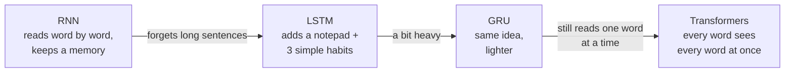
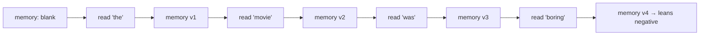
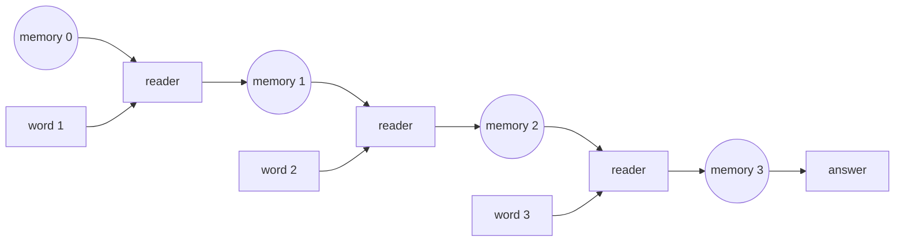
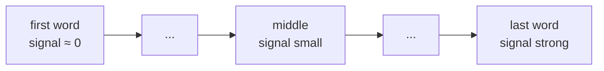
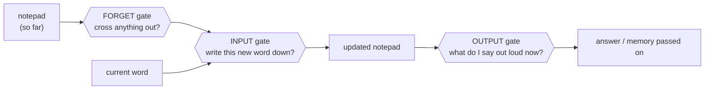
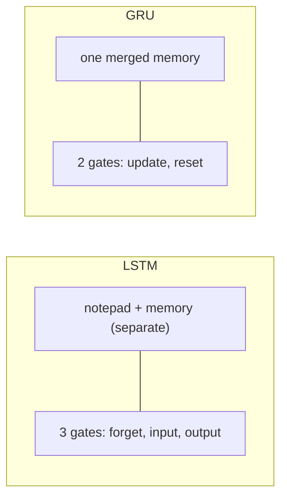
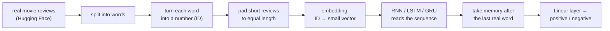

# Sequence Models — RNN, LSTM, GRU

> **This document is self-contained:** all theory, worked examples, and diagrams are here — read it on its own, no notebook required.
> **Separate code companion:** `sequence_models_rnn_lstm_gru_lab.ipynb` has the runnable code for everything discussed below, if you want to execute it yourself.
> **Goal for this module:** understand *why* sequence models exist, what a hidden state is, why plain RNNs forget, how LSTM/GRU fix that, and how to use `nn.LSTM` / `nn.GRU` correctly in PyTorch.

---

## The whole lesson in one line



We'll go RNN → LSTM → GRU in this module, and point at Transformers as the next module.

---

## Part 1 — Why a normal neural network isn't enough

Every model we've built so far takes a fixed chunk of data — a row of numbers, a 224×224 image — and gives an answer. Text is different. Text is a *sequence*, and the order of the words changes the meaning.

**Think about it:** do these two sentences mean the same thing?
- "the food was **not** good"
- "the food was good"

They don't — one word, placed at one spot, flips the meaning. A model that just counts which words appear ("good": yes, "not": yes, "food": yes) sees these two as almost identical. That's the problem.

**Two things a normal network can't handle:**

| Problem | Example |
|---|---|
| Sentences have **different lengths** | a 5-word review and a 50-word review can't both fit the same fixed input |
| **Order carries meaning** | "dog bites man" vs "man bites dog" — same words, opposite story |

We need a model that reads a sequence *in order*, one item at a time, and remembers what it read. That's a sequence model.

---

## Part 2 — The big idea: memory

Think about how *you* read a movie review to decide if it's positive.

> "The movie started slow and I almost left … but the last twenty minutes were incredible."

You don't judge each word on its own. You carry a running impression in your head. After "started slow" you're leaning negative. After "but the last twenty minutes were incredible" you flip to positive. You keep updating one mental summary as you go.

**That running summary is the "hidden state."** In the model it's just a small list of numbers — say 20 of them — that gets updated after every word. It's the model's memory of "the story so far."



---

## Part 3 — The RNN: one reader, used again and again

An RNN is one small "reader" unit. It looks at the current word plus the current memory, and produces an updated memory. Then it does the exact same thing for the next word. Same reader, same settings, every single step.



> Every "reader" box is the **same** reader — it's drawn once per word only to show the memory moving forward.

**The rule it follows, in plain words:**

> new memory = squash( a bit of the new word + a bit of the old memory )

The "squash" (a function called `tanh`) just keeps the numbers from blowing up as they get reused over and over.

That's the whole rule `nn.RNN` runs internally. And here's the useful practical fact that falls out of it: `nn.RNN`, `nn.LSTM`, and `nn.GRU` all share one call signature — same constructor arguments, same `(batch, seq_len, features)` input shape. Feed the same dummy input to all three:

```text
input:    torch.randn(4, 10, 8)     # (batch=4, seq_len=10, input_size=8)

nn.RNN  : output (4, 10, 16)   hidden (1, 4, 16)
nn.LSTM : output (4, 10, 16)   hidden (1, 4, 16)   <- actually a (h_n, c_n) pair
nn.GRU  : output (4, 10, 16)   hidden (1, 4, 16)
```

Identical shapes across all three. The only structural difference is that LSTM's `hidden` is a `(h_n, c_n)` pair instead of a single tensor — because it alone carries a separate cell state. That's why you can swap one for another in code just by changing the class name, and it's exactly what lets Part 10's mini-project train the same architecture three times with one line changed.

**Think about it:** a 5-word sentence and a 500-word sentence — how does the same little reader handle both? *(It just runs 5 times, or 500 times. The model's size never changes.)*

**Where this shows up outside the classroom:**

| Application | Input sequence | Output |
|---|---|---|
| Sentiment analysis | words in a review | positive / negative |
| Language modeling | previous words | probability of the next word |
| Music generation | previous notes | next note |
| Log / anomaly detection | system events over time | normal / anomaly |

---

## Part 4 — The RNN's weakness: it forgets

Here's the catch. Every word slightly overwrites the memory. After a few words, fine. After fifty words, the beginning of the sentence is a blur.

**The classic example:**

> "The **keys**, which I left on the kitchen counter after my run this morning, **were** missing."

To choose "were" (not "was"), the model has to remember "keys" was plural — from about 15 words back. A plain RNN usually can't hold on that long.

**Why, without the math:** during training the model learns by sending a "correction signal" backward through every word. Each step shrinks that signal a little. Over many steps it shrinks to basically nothing, so the early words never get corrected. This is called the **vanishing gradient problem**.

**The math behind it (worth working through once):** training uses backpropagation, which computes how much the loss at the end should adjust the memory way back at word 1, by chaining derivatives backward through every step in between:

```text
∂Loss/∂h₁  =  ∂Loss/∂h_T  ×  (∂h_T/∂h_T₋₁)  ×  (∂h_T₋₁/∂h_T₋₂)  ×  ...  ×  (∂h₂/∂h₁)
```

For a plain RNN, each one of those middle terms works out to roughly:

```text
∂hₜ/∂hₜ₋₁  ≈  W_hh · tanh'(...)
```

Two things make this shrink on every single multiplication:
- **`tanh'(x)` maxes out at 1** (only exactly at `x = 0`) and gets smaller the further the activation is pushed from zero — so most of the time this factor is meaningfully less than 1.
- **`W_hh` is one fixed weight matrix, reused at every step**, with nothing in the architecture protecting the signal from it.

Multiply ~20–40 numbers together that are each a bit less than 1, and the product doesn't shrink politely — it collapses toward zero geometrically. That's exactly the "34 million times weaker" measured below: not a fluke of this particular sentence, but the predictable result of repeated multiplication by numbers less than 1. (The mirror-image failure — numbers a bit *more* than 1, multiplied over and over — is the *exploding* gradient, fixed easily with gradient clipping. Vanishing has no equally easy fix, which is why the LSTM had to change the architecture itself.)

**Measured directly, on a 40-step sequence, tracking how strong the correction signal is at each step:**

```text
signal reaching the last word:      1.975
signal reaching the first word:     0.00000006   ← about 34 million times weaker
```



**Takeaway:** plain RNNs are fine for short sequences and hopeless for long-range connections — and no amount of extra training fixes this, because the problem is structural (baked into the recurrence itself), not a matter of not having trained long enough.

**This shows up as a real number, not just a diagram — see Part 10:** when RNN, LSTM, and GRU are trained side by side on the same real dataset, the plain RNN consistently lands behind LSTM and GRU on validation accuracy — the vanishing-gradient weakness costing real accuracy points, not just a theoretical concern.

---

## Part 5 — The LSTM: a reader with a notepad

The LSTM keeps the same idea — read word by word, carry memory — but gives the reader a **notepad** it can write on and a few simple **habits** for managing it.

The notepad (its real name is the **cell state**) is the key trick: **things written on it stay there** until the reader deliberately crosses them out. It is *not* rewritten every word like the plain RNN's memory. That's how "France" can survive on the pad until "French" shows up six words later.

**Two memories, two jobs.** This is the detail that trips people up: an LSTM cell carries **two** separate vectors forward at every step, not one.

| | Cₜ — the cell state ("notepad") | hₜ — the hidden state ("what to say now") |
|---|---|---|
| Role | protected, long-term memory | short-term, task-facing output |
| Updated by | **addition** (Part 6) — rarely wiped clean | rebuilt fresh every step, from a filtered view of Cₜ |
| Who sees it | stays inside the cell, passed to the next time step | handed to the next layer / used for the prediction |

A plain RNN only has the second of these — one vector, completely overwritten every step. The LSTM's whole trick is splitting memory into a slow-changing, protected part (`Cₜ`) that things can survive in for a long time, and a fast-changing, task-facing part (`hₜ`) that only ever shows what's currently relevant — decided by the output gate, below.

Three habits — these are the **gates**. Each one is just a small dial (a number between 0 and 1) the model *learns* to set based on the current word and the current memory.



**The same picture, as the actual wiring inside one LSTM cell — trace every arrow yourself once:**

```text
Inputs at time step t:

        hₜ₋₁  = previous hidden state
        xₜ    = current input
        Cₜ₋₁  = previous cell state


                       ┌───────────────────────┐
                       │ Concatenate            │
                       │ [hₜ₋₁, xₜ]             │
                       └───────────┬───────────┘
                                   │
             ┌─────────────────────┼─────────────────────┐
             │                     │                     │
             ▼                     ▼                     ▼
      ┌─────────────┐       ┌─────────────┐       ┌─────────────┐
      │ Forget Gate │       │ Input Gate  │       │ Candidate   │
      │             │       │             │       │ Memory      │
      │ fₜ = σ(...) │       │ iₜ = σ(...) │       │ g̃ₜ=tanh(...)│
      └──────┬──────┘       └──────┬──────┘       └──────┬──────┘
             │                     │                     │
             │                     └──────────┬──────────┘
             │                                │
             ▼                                ▼
      ┌─────────────┐                  ┌─────────────┐
      │ Elementwise │                  │ Elementwise │
      │ multiply    │                  │ multiply    │
      │ fₜ ⊙ Cₜ₋₁   │                  │ iₜ ⊙ g̃ₜ     │
      └──────┬──────┘                  └──────┬──────┘
             │                                │
             └──────────────┬─────────────────┘
                            ▼
                     ┌─────────────┐
                     │ Add         │
                     │ Cₜ =        │
                     │ fₜ⊙Cₜ₋₁ +   │
                     │ iₜ⊙g̃ₜ      │
                     └──────┬──────┘
                            │
                            ▼
                    New cell state Cₜ
                            │
                            ▼
                     ┌─────────────┐
                     │ tanh(Cₜ)    │
                     └──────┬──────┘
                            │
                       ┌────▼─────┐
                       │ Output   │
                       │ Gate     │
                       │ oₜ=σ(...)│
                       └────┬─────┘
                            │
                            ▼
                     ┌──────────────┐
                     │ Elementwise  │
                     │ multiply     │
                     │ hₜ=oₜ⊙tanh(Cₜ)│
                     └──────┬───────┘
                            │
                            ▼
                    New hidden state hₜ

Outputs:
        Cₜ goes to next LSTM cell as long-term memory (the notepad, carried forward untouched
            except for what the forget/input gates just changed)
        hₜ goes to next LSTM cell AND can also be used for prediction (what the output gate
            decided to reveal, right now)
```

**Reading it left to right:** everything starts from ONE concatenated vector `[hₜ₋₁, xₜ]` — "old memory" and "new word" are not separate inputs to separate gates; all three gates and the candidate look at the SAME combined picture, just with different learned weights deciding what each one cares about. The forget/input paths run in parallel and only meet at the final "Add" step to produce `Cₜ` — that addition is the whole "notepad" trick (Part 6): old information isn't overwritten, it's kept and something new is layered on top of it. Only AFTER `Cₜ` is finalized does the output gate get a look at it, to decide what `hₜ` reveals.

### The forget gate
Decides how much of the current notepad to keep versus wipe. Near 1 = keep everything, near 0 = erase it.
It fires low when the topic changes — a new subject appears, a new sentence starts — so old notes don't hang around and pollute the new context.
Example: "My cat is fast. My dog is slow." — at the second "My", the forget gate drops so "cat" is cleared before "dog" is written.

### The input gate
Decides how much of the current word is worth writing onto the notepad. Near 0 = ignore this word, near 1 = write it in fully.
It stays low for filler words (*the, of, was*) and opens up for meaningful ones (*excellent, France, not*).
Example: reading "the movie was **excellent**" — the gate barely reacts to "the/movie/was" and opens wide on "excellent".

### The output gate
Decides how much of the notepad to actually reveal *right now* as the answer / the memory passed forward. The notepad itself keeps flowing untouched — this only controls what's exposed this step.
It lets the model store something quietly and only bring it out when it becomes relevant.
Example: "France" is written early but kept hidden until the word "French" arrives and needs it.

**Putting it together:** read a word → forget gate trims the notepad → input gate maybe writes the new word → output gate decides what to report. Repeat for every word.

**A quick story to tie the three together — "I grew up in France … so I speak fluent French."**

| Word | What the LSTM does |
|---|---|
| France | **Input gate opens** — writes "country = France" on the pad |
| so, I, speak, fluent | **Forget gate stays shut** — "France" stays on the pad, untouched |
| French | **Output gate opens** — pulls "France" off the pad to get the connection right |

A plain RNN would have smudged "France" into mush by the time it reached "French." The LSTM's pad kept it clean.

**In PyTorch, all of this lives inside one line** — `nn.LSTM(input_size, hidden_size, batch_first=True)` — the way real projects use it, without hand-building gates from raw tensors. The derivation above is what's actually happening every time that line runs.


---

## Part 6 — Why the notepad fixes the forgetting

> Because important notes are **kept as-is** instead of being diluted every step, the training correction signal can travel all the way back to the early words without fading away.

**The mechanism, one level deeper — compare the two recurrences directly:**

```text
Plain RNN:   hₜ = tanh( W · hₜ₋₁ + ... )        →  ∂hₜ/∂hₜ₋₁  involves W AND tanh', EVERY step
LSTM:        Cₜ = fₜ ⊙ Cₜ₋₁ + iₜ ⊙ g̃ₜ            →  ∂Cₜ/∂Cₜ₋₁  =  fₜ   (elementwise — no matrix multiply, no squashing)
```

The RNN's recurrence is a **matrix multiplication squashed through tanh**, forced on every single connection, whether or not that information matters. The LSTM's cell-state recurrence is an **addition** — the gradient of `Cₜ` with respect to `Cₜ₋₁` is just the forget gate's value, `fₜ`, applied elementwise. No weight matrix, no tanh, nothing that automatically shrinks it.

If the forget gate stays close to 1 for every step between "France" and "French," the gradient for that specific connection barely shrinks along the way — it's riding what's often called a **gradient highway** (or "constant error carousel" in the original LSTM paper): a path back through time that skips the repeated tanh-squashing a plain RNN forces every signal through.

**The crucial word is *learned*.** The network isn't handed a permanently-open highway for every word — it *learns*, through training, to set `fₜ` near 1 specifically for information worth protecting, and lets it drop for information that's safe to overwrite (the "My cat is fast. My dog is slow." example from Part 5). That's what makes this different from just "removing the nonlinearity everywhere": the model gets to *choose*, per word, whether this step should be forgettable or protected.

**To be fair, it doesn't *perfectly* solve forgetting.** If the forget gate gets trained to a value well below 1, the exact same shrinking-by-repeated-multiplication problem returns — just more slowly, since `fₜ` values are usually closer to 1 than a plain RNN's uncontrolled `W · tanh'` product. And extremely long documents (hundreds of steps) can still overwhelm even a well-trained gate. But turning "structurally impossible" into "works fine in practice, most of the time" was enough to make LSTMs the default for years.

---

## Part 7 — The problem with the LSTM

The LSTM works well, but it's not free.

- **It's heavy.** Three gates plus a candidate calculation means four little neural networks running at every single word — roughly **4× the parameters** of a plain RNN of the same size.
- **It's slower** to train and to run, which matters on long sequences or small devices.
- **It needs more data.** More parameters means more room to overfit when the dataset is small.
- **The three gates overlap.** In practice "forget" and "input" almost always move together — if you're wiping an old note you're usually writing a new one in its place. So one of the two is often redundant.

That last point is the opening someone took: *do we really need all three gates and a separate notepad?*

---

## Part 8 — The GRU: a lighter LSTM

The GRU keeps the same core idea — a protected memory managed by learned gates — but strips it down.

- **No separate notepad.** Where the LSTM keeps two vectors — `Cₜ` (protected) and `hₜ` (exposed) — GRU merges them into one. `hₜ` does *both* jobs at once: it's the protected memory **and** the thing exposed for prediction, every single step. That's the entire structural difference between the two architectures — everything else follows from this one design choice.
- **Two gates instead of three.**



### The update gate
Decides how much of the old memory to keep versus overwrite with new information. Near 0 = keep the old memory, near 1 = replace it.
This one gate does the job of the LSTM's forget *and* input gates together — since those two usually moved as a pair anyway.
Example: on a filler word it stays near 0 (carry the memory forward); on a meaningful word it opens up to write.

### The reset gate
Decides how much of the past memory to look at when forming the "new information" for this word. Near 0 = ignore the past and read this word fresh, near 1 = use the full context.
Useful at boundaries — a new clause or sentence — where the earlier context would only confuse the reading of the current word.

**The same wiring, drawn the same way as the LSTM diagram above — put them side by side and spot what's missing:**

```text
Inputs at time step t:

        hₜ₋₁  = previous hidden state   <- this is the ONLY memory GRU has; no separate notepad


                       ┌───────────────────────┐
                       │ Concatenate            │
                       │ [hₜ₋₁, xₜ]             │
                       └───────────┬───────────┘
                                   │
                    ┌──────────────┼──────────────┐
                    │              │              │
                    ▼              ▼              │
             ┌─────────────┐ ┌─────────────┐      │
             │ Reset Gate  │ │ Update Gate │       │
             │ rₜ = σ(...) │ │ zₜ = σ(...) │       │
             └──────┬──────┘ └──────┬──────┘      │
                    │               │             │
                    ▼               │             │
             ┌─────────────┐        │             │
             │ Elementwise │        │             │
             │ multiply    │        │             │
             │ rₜ ⊙ hₜ₋₁   │        │             │
             └──────┬──────┘        │             │
                    │               │             │
                    ▼               │             │
             ┌──────────────────┐   │             │
             │ Concatenate      │   │             │
             │ [rₜ⊙hₜ₋₁, xₜ]    │   │             │
             └────────┬─────────┘   │             │
                      ▼              │             │
             ┌──────────────────┐   │             │
             │ Candidate        │   │             │
             │ nₜ = tanh(...)   │   │             │
             └────────┬─────────┘   │             │
                      │              │             │
                      ▼              ▼             ▼
              ┌──────────────────────────────────────┐
              │ Blend (interpolate — no separate add) │
              │ hₜ = (1-zₜ)⊙nₜ + zₜ⊙hₜ₋₁              │
              └───────────────────┬────────────────┘
                                  │
                                  ▼
                          New hidden state hₜ

Outputs:
        hₜ goes to next GRU cell AND can also be used for prediction
        (no separate long-term state to hand off — one vector does both jobs, every step)
```

**What to notice when comparing the two diagrams side by side:**
- **No `Cₜ` box anywhere.** GRU never builds a separate protected notepad — there's only ever `hₜ`.
- **No output gate, no final "reveal" step.** Whatever `hₜ` comes out of the blend IS what gets used, both for the next cell and for any prediction — there's no separate "decide what to show" gate the way LSTM has one.
- **"Add" became "Blend."** LSTM ADDS new information on top of old (`fₜ⊙Cₜ₋₁ + iₜ⊙g̃ₜ`) — nothing is thrown away by that operation itself. GRU INTERPOLATES between old and new (`(1-zₜ)⊙nₜ + zₜ⊙hₜ₋₁`) — it's always a weighted mix of the two, never a pure accumulation.
- **The reset gate only touches `hₜ₋₁`**, not `xₜ` — it multiplies the hidden state BEFORE concatenating with the input, so the current word's own information always reaches the candidate untouched; only how much of the PAST gets consulted is gated.

**GRU keeps the same gradient highway as LSTM, just with one shared state instead of two.** Look at the blend equation again:

```text
hₜ = (1-zₜ) ⊙ nₜ + zₜ ⊙ hₜ₋₁          →  ∂hₜ/∂hₜ₋₁  ≈  zₜ    (elementwise, when zₜ is close to 1)
```

Same shape as the LSTM's cell-state recurrence from Part 6 — a direct, additive path for `hₜ₋₁` to reach `hₜ`, scaled by a learned gate instead of being forced through a weight matrix and `tanh` every step. When the update gate `zₜ` stays close to 1, the gradient barely shrinks passing through that word — the same "protect what matters" mechanism as LSTM's forget gate, just running on one merged state instead of two.

**Why anyone picks GRU:** ~25% fewer parameters, so it trains faster and needs less data. On most tasks it's just as accurate as an LSTM.

**Rule of thumb:** try both, keep whichever validates better. Use plain RNN only for learning the concept.

| | Plain RNN | LSTM | GRU |
|---|---|---|---|
| Handles long sentences | poorly | well | well |
| Speed / size | lightest | heaviest | middle |
| Use it when | learning the concept | accuracy matters, plenty of data | smaller data, need speed |

---

## Part 9 — Using them in PyTorch (the part you'll actually need for code)

The concepts are the hard part. The code is three lines. The only thing that trips people up is tensor shapes — so here's the cheat sheet.

```text
INPUT you give it:     (batch, sequence_length, features_per_step)

nn.RNN / nn.GRU give back two things:
   output  →  the memory after EVERY word          (batch, seq_len, hidden_size)
   h_n     →  the memory after the LAST word only   (layers, batch, hidden_size)

nn.LSTM gives back three (because of the notepad):
   output, h_n  →  same as above
   c_n          →  the final notepad                (layers, batch, hidden_size)
```

- For "read the whole sentence, give one answer" (like the sentiment project) → use the memory after the last real word.
- **Bidirectional** = run two readers, one left-to-right, one right-to-left, and combine. Great when you have the *whole* sentence (sentiment, tagging). Useless for live typing/streaming — you can't read the future.
- **Stacking** (`num_layers=2`) = feed one RNN's outputs into a second RNN. Deeper = more abstract patterns. Start with 1 layer.

This is exactly the shape table from Part 3's worked example — worth flipping back to if the `output` vs. `h_n` vs. `c_n` distinction still feels abstract.

---

## Part 10 — The mini-project: does a review sound positive or negative?

Now it all comes together on a real task — Rotten Tomatoes movie-review snippets, a real Hugging Face dataset, not hand-written templates.



The same architecture, unmodified, gets trained three times — as an RNN, an LSTM, and a GRU — on the same real critic snippets, so the comparison is fair.

**The payoff — real validation accuracy, training the exact same architecture three times:**

```text
model      params   best val acc
RNN       582,594         0.6820
LSTM      607,554         0.7045
GRU       599,234         0.7092
```

There's the vanishing-gradient weakness from Part 4, showing up as a real number — the plain RNN trails both gated models. LSTM and GRU land close together, with GRU slightly ahead here on fewer parameters than LSTM — exactly the "try both, keep whichever validates better" rule of thumb from Part 8.

**The honest part:** tested on hand-written sentences it never saw in training, the LSTM confidently generalizes phrase-level sentiment —

```text
"smart, funny, and surprisingly touching"                          → POSITIVE (100%)
"dumb, unfunny, and surprisingly boring"                           → NEGATIVE (99%)
"an ambitious film that ultimately delivers on its promise"        → POSITIVE (95%)
"an ambitious film that ultimately fails to deliver on its promise" → NEGATIVE (81%)
```

— but does **not** reliably flip on the literal word "not":

```text
"the movie was excellent"              → NEGATIVE (64%)
"the movie was not excellent"          → NEGATIVE (75%)
```

This isn't a broken model. A few epochs on ~8.5k real, free-form critic snippets simply doesn't drill "not" as a flip-signal the way a synthetic dataset that repeats that exact pattern in every sentence would. The model learned the easier, more frequent signal (which words/phrases carry sentiment) before the harder, rarer one (that one small word can invert everything around it). That gap — between what a model *can* learn and what its *actual training data* teaches it — is one of the most important lessons in applied ML, and real data is what surfaces it.

---
